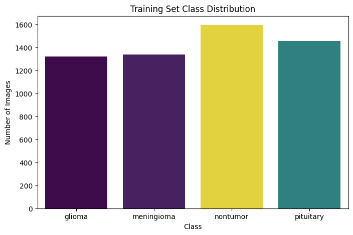
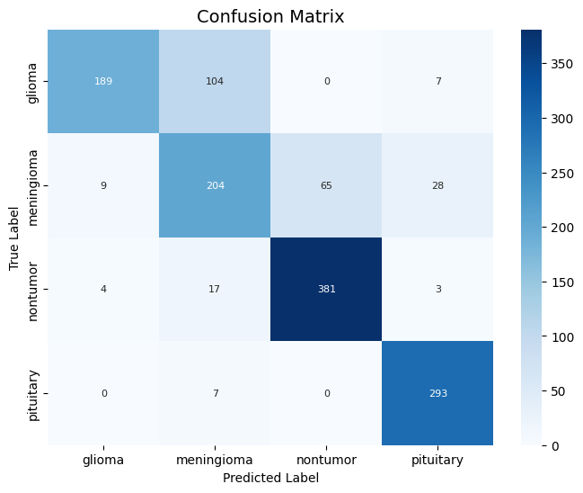
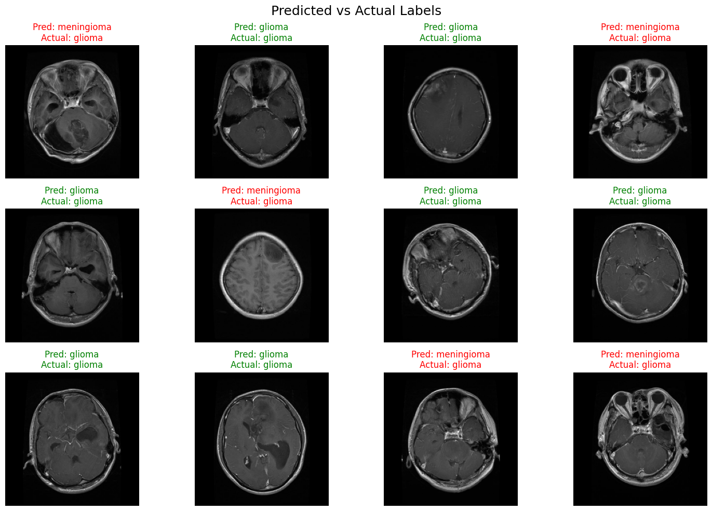
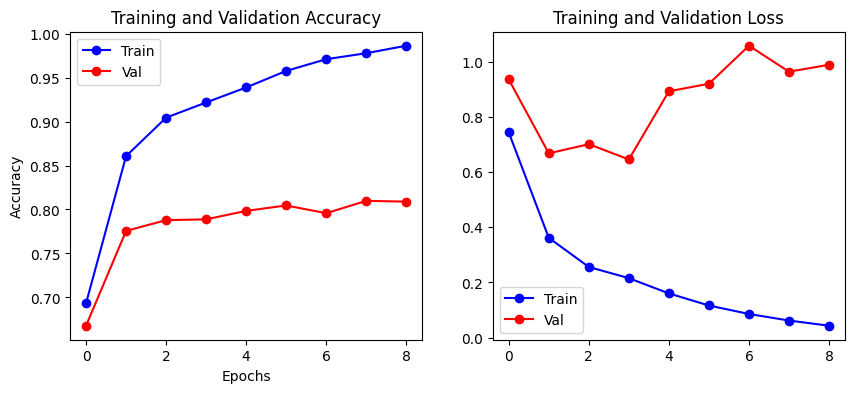

# Brain Tumor Classification using CNN

This project implements a Convolutional Neural Network (CNN) to classify brain MRI images into four categories:
- Glioma
- Meningioma
- Pituitary tumor
- Non-tumor

The goal of this project is to evaluate the effectiveness of deep learning models in distinguishing between visually similar brain tumor types using
grayscale MRI data.

## Model
- Framework: TensorFlow / Keras
- Input: 224×224 grayscale MRI images
- Architecture: 3 convolutional blocks + fully connected layers
- Optimization: Adam optimizer
- Evaluation: Accuracy, Precision, Recall, F1-score, Confusion Matrix

## Dataset
The dataset is NOT included in this repository but the one used is from a the publicly available brain MRI dataset from Kaggle containing labeled images for four classes: glioma, meningioma, pituitary tumor, and non-tumor.

Expected directory structure:

data/
├── Train/
│   ├── glioma/
│   ├── meningioma/
│   ├── nontumor/
│   └── pituitary/
└── Test/
    ├── glioma/
    ├── meningioma/
    ├── nontumor/
    └── pituitary/

## Results
### Training Set Class Distribution


### Classification Performance
The trained CNN achieves an overall test accuracy of **88%**.
Class-wise performance is summarized below:

| Class        | Precision | Recall | F1-score |
|--------------|-----------|--------|----------|
| Glioma       | 0.94      | 0.85   | 0.89     |
| Meningioma   | 0.81      | 0.68   | 0.74     |
| Nontumor     | 0.88      | 0.98   | 0.92     |
| Pituitary    | 0.90      | 0.99   | 0.94     |
| **Overall**  |           |        | **0.88** |


### Confusion Matrix


### Predicted vs Actual Labels


### Training Curves


## How to Run
Install dependencies, train the model, and run analysis and visualization:

```bash
pip install -r requirements.txt
python Brain_tumor_SamayAsubadin.py
notebook analysis.ipynb 